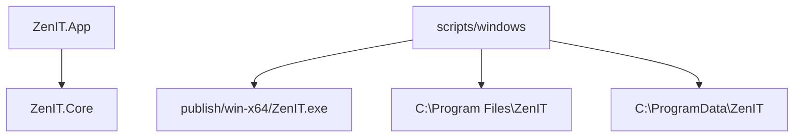
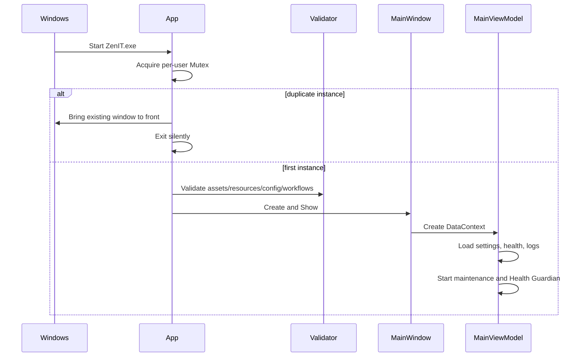
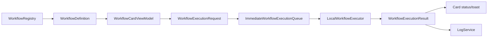
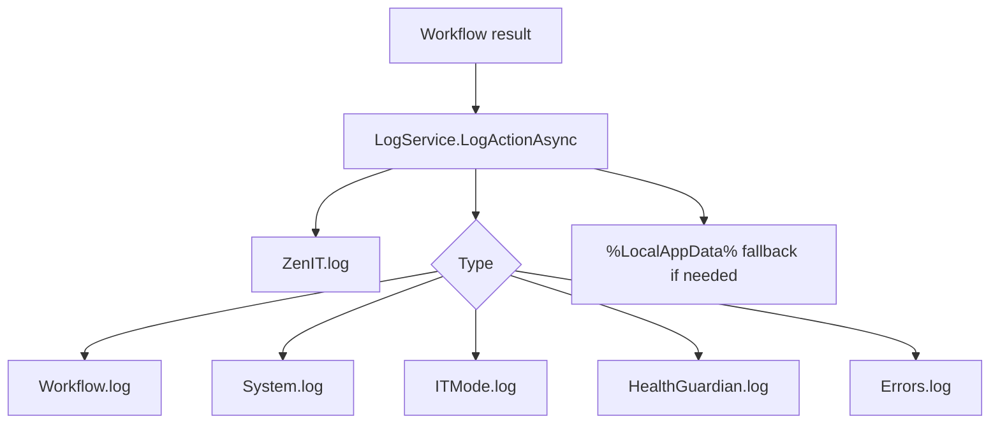
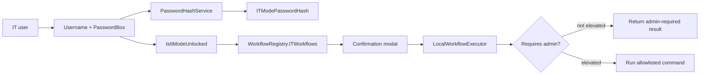
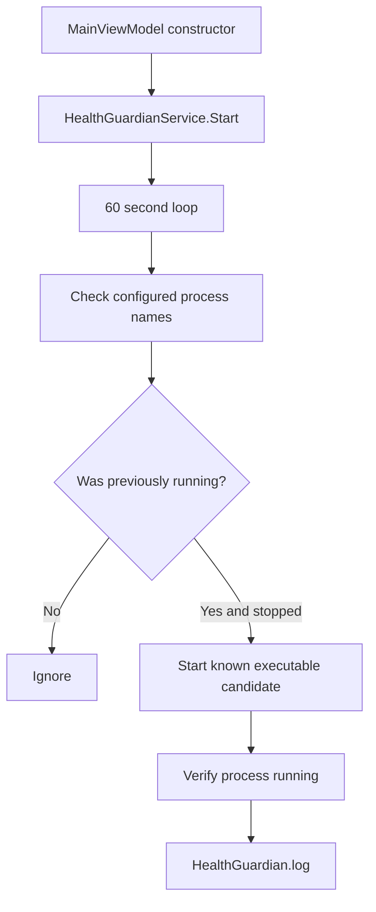
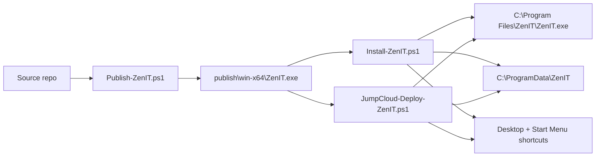

# ZenIT Architecture Deep Dive

Date: 2026-07-03
Version reviewed: 1.0.0

## Architectural Intent

ZenIT is designed as a local-first Windows support assistant:

- employee-safe workflows run without elevation
- IT workflows are gated behind IT Mode
- workflows are centrally registered
- reports and logs stay local
- deployment works through JumpCloud or local admin install
- future elevated repairs are expected to move into `ZenIT.Service`

## Solution Structure

```text
src\ZenIT.App
  App.xaml / App.xaml.cs
  MainWindow.xaml / MainWindow.xaml.cs
  Assets
  ViewModels

src\ZenIT.Core
  Actions
  Configuration
  Execution
  Localization
  Logging
  Maintenance
  Models
  Reports
  Security
  Services
  Workflows

src\ZenIT.Service
  README.md
```

## Project Dependencies



`ZenIT.Core` has no dependency on `ZenIT.App`. This is correct and should be preserved.

## App Startup Flow



Startup crash handling writes rich diagnostics to `StartupCrash.log`.

## WPF Shell

`MainWindow.xaml` is a single-shell XAML file that contains:

- global converters and visual styles
- sidebar
- header and language switcher
- Home
- Quick Fixes
- My Device
- IT Mode unlock/dashboard/logs/reports/advanced repairs
- About
- confirmation overlay
- toast display

This gives one consistent design system, but the file is too large for long-term maintainability.

Recommended split:

```text
Views\HomeView.xaml
Views\QuickFixesView.xaml
Views\MyDeviceView.xaml
Views\ItModeView.xaml
Views\AboutView.xaml
Controls\WorkflowCard.xaml
Controls\StatusChip.xaml
Controls\LanguageSwitcher.xaml
```

## ViewModel Composition

`MainViewModel` currently owns:

- dependency creation
- navigation state
- commands
- workflow card collections
- health metrics
- log parsing display
- IT Mode authentication
- diagnostics
- language switching
- toast and confirmation overlay state
- startup maintenance

Recommended split:

```text
ShellViewModel
HomeViewModel
QuickFixesViewModel
MyDeviceViewModel
ItModeViewModel
LogsViewModel
AboutViewModel
LocalizationViewModel or LanguageService
```

## Workflow Architecture



Core model:

- `WorkflowId`: stable enum identity.
- `WorkflowDefinition`: display/risk/tier metadata.
- `WorkflowAccessTier`: Employee or IT.
- `WorkflowRiskLevel`: Low, Medium, High.
- `WorkflowOutcome`: Success, RepairAttempted, NeedsIT, CannotVerify.
- `WorkflowStepResult`: per-step technical result.

The queue is currently immediate. The abstraction is useful for future remote execution, JumpCloud orchestration, or service-backed execution.

## Workflow Integrity

`WorkflowIntegrityValidator` checks:

- duplicate IDs
- enum values not registered
- empty titles
- invalid timeouts
- employee workflows requiring IT Mode
- unapproved categories
- IT workflows not requiring confirmation
- admin workflows marked low risk

This should become a unit test in addition to startup validation.

## Local Workflow Executor

`LocalWorkflowExecutor` is the largest Core class. It handles:

- employee workflows
- IT workflows
- process execution
- registry hints
- cache cleanup
- report generation
- device/system diagnostics
- command validation for IT workflows

Strength: all local execution behavior is easy to find.

Weakness: one class has too many responsibilities. Suggested decomposition:

```text
NetworkWorkflowHandler
PerformanceWorkflowHandler
AppRepairWorkflowHandler
MeetingDeviceWorkflowHandler
SecurityWorkflowHandler
ReportWorkflowHandler
ItRepairWorkflowHandler
WindowsDiagnosticsService
SafeCleanupService
KnownApplicationService
```

## Logging Architecture



Parsing:

- Reads primary, fallback, and active log path.
- Parses key-value entries.
- Caches parsed summaries until file signatures change.

## Report Architecture

`ReportDocument` is a common model. `ReportExporter` writes:

- TXT
- JSON
- HTML

The HTML report is self-contained and uses ZenHR colors. Report body content is currently English.

## Localization Architecture

`LocalizedStrings` is a static dictionary provider:

```text
language code -> key -> string
```

The app stores selected language in config and applies:

- navigation labels
- workflow card labels
- button labels
- page headings
- `FlowDirection`

Current validator checks:

- en/ar key existence
- missing keys
- duplicate keys beyond expected en/ar pairs
- required page/workflow labels

Future recommendation:

- move to `.resx` or JSON resource files
- add tooling that scans XAML and ViewModel visible strings
- localize dynamic status values

## Theme Architecture

`ThemeManager` normalizes theme values, but the actual visual system is mostly in `App.xaml` and `MainWindow.xaml`. `Light` and `HighContrast` are setting-level placeholders.

Future theme architecture:

```text
Themes\Dark.xaml
Themes\Light.xaml
Themes\HighContrast.xaml
ThemeManager applies merged dictionary
```

## IT Mode Architecture



IT Mode is a UX and workflow gate. It is not a substitute for OS-level authorization.

## Health Guardian Architecture



The guardian is not a Windows service. It is an in-process app background task.

## Deployment Architecture



## Main Architectural Recommendations

1. Split `MainWindow.xaml` and `MainViewModel.cs` into page-level components.
2. Split `LocalWorkflowExecutor` into workflow handlers and shared diagnostic services.
3. Add a small dependency injection container or composition root.
4. Move IT credential policy to a protected admin-writable location.
5. Add unit tests for workflow integrity, command allowlists, report privacy, config normalization, and log parsing.
6. Replace static dictionary localization with resource files and scanner tooling.
7. Implement a real managed Windows service for elevated repairs.

## Phase 26 Architecture Addendum

Phase 26 introduced a protected IT policy split:

```text
C:\ProgramData\ZenIT\Config\appsettings.json
  user/app preferences such as language, theme, update channel, and retention

C:\ProgramData\ZenIT\Policy\itpolicy.json
  EnableITMode, ITModeUsername, ITModePasswordHash, AllowITCredentialChanges, ContactITUrl
```

Install and JumpCloud deployment scripts grant Users Modify only to Config, Logs, and Reports. The Policy folder is admin/SYSTEM writable and Users read-only.

The app now uses `ITPolicyService` for IT Mode authentication and Contact IT URL policy. User-writable appsettings cannot override IT credentials.

Phase 26 also added `src/ZenIT.Tests`, making workflow registration, command allowlists, report privacy, localization, config/policy normalization, and log parsing executable checks rather than documentation-only expectations.
