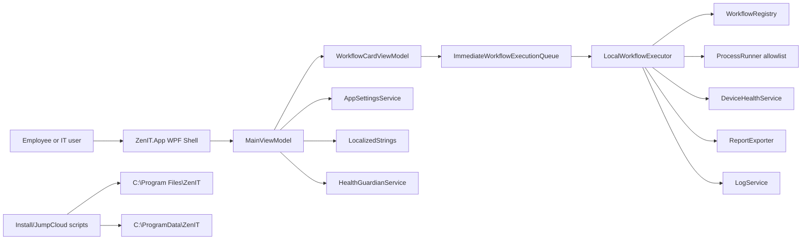

# ZenIT Full System Audit

Date: 2026-07-03
Version reviewed: 1.0.0
Scope: source, XAML, scripts, assets, docs, and deployment structure. Generated `bin`, `obj`, and `publish` outputs were inventoried as build artifacts rather than treated as authored source.

## Executive Summary

ZenIT is a .NET 8 WPF desktop application for ZenHR employee self-service IT support. The product has matured into a credible release candidate: it has a premium WPF shell, bilingual English/Arabic UI architecture, single-instance startup, fail-safe logging, local report generation, an employee workflow catalog, IT Mode authentication, JumpCloud-oriented deployment scripts, and validation scripts.

The system is strongest in its clear security intent: workflows are registered, employee execution avoids arbitrary command input, logs are local, support reports are allowlist-based, and IT Mode stores only a SHA256 hash. The app is also operationally practical because it publishes as a self-contained single EXE and installs through simple PowerShell scripts.

The biggest engineering risks are maintainability and policy drift. `MainWindow.xaml` and `MainViewModel.cs` are very large, workflow comments and behavior disagree in a few important places, legacy action infrastructure still exists beside the workflow engine, and several user-facing strings remain hardcoded in dynamic ViewModel paths. Phase 28 moved app repair workflows to automatic allowlisted process recovery; the important rollout concern is now keeping those allowlists narrow and audited as new applications are added.

Recommendation: ZenIT is ready for a controlled production pilot or limited rollout. Before company-wide rollout, fix the high-impact safety/UX mismatches, harden IT Mode config storage, add automated tests, and refactor the monolithic UI/ViewModel structure.

## Repository Inventory

```text
C:\ZenIT
|-- ZenIT.sln
|-- README.md
|-- assets\logo
|   `-- logo1.png
|-- docs
|   |-- Architecture.md
|   |-- Button-Function-Audit.md
|   |-- Enterprise-QA-Checklist.md
|   |-- JumpCloud-Deployment-Guide.md
|   |-- Pilot-Deployment-Guide.md
|   |-- Pilot-Test-Checklist.md
|   |-- Release-Candidate-Checklist.md
|   |-- Security-Audit.md
|   `-- Workflow-Implementation-Matrix.md
|-- scripts\windows
|   |-- Install-ZenIT.ps1
|   |-- JumpCloud-Deploy-ZenIT.ps1
|   |-- JumpCloud-Uninstall-ZenIT.ps1
|   |-- Publish-ZenIT.ps1
|   |-- Test-ZenITInstall.ps1
|   |-- Test-ZenITLocalization.ps1
|   `-- Uninstall-ZenIT.ps1
|-- src
|   |-- ZenIT.App
|   |-- ZenIT.Core
|   `-- ZenIT.Service
`-- publish / artifacts / bin / obj outputs
```

Active solution projects:

| Project | Target | Responsibility |
| --- | --- | --- |
| `ZenIT.App` | `net8.0-windows`, WPF, WinExe | App shell, startup, XAML UI, navigation, ViewModels, language switching, IT Mode UI |
| `ZenIT.Core` | `net8.0` | Workflows, execution, device health, logging, reports, config, security helpers |
| `ZenIT.Service` | Placeholder only | Reserved for future elevated managed service |

## Overall Architecture



### Layer Responsibilities

`ZenIT.App` owns the user experience. It creates the window, holds most page state in `MainViewModel`, renders workflow cards from the registry, handles IT Mode authentication UI, opens log/report folders, switches language, and shows toast/confirmation states.

`ZenIT.Core` owns business and system behavior. It defines the registered workflows, safe execution contracts, health collection, process allowlists, logging, report export, settings, and password hashing.

`scripts/windows` owns deployment operations. Scripts publish, install, uninstall, deploy through JumpCloud, validate installation, and validate localization resource coverage.

`docs` currently contains deployment, QA, security, architecture, and workflow documentation. This audit expands that set.

## Startup And Lifecycle

Startup is implemented in `App.xaml.cs`.

Key behavior:

- Registers global handlers for `DispatcherUnhandledException`, `AppDomain.CurrentDomain.UnhandledException`, and `TaskScheduler.UnobservedTaskException`.
- Uses a per-user named mutex to enforce a single instance.
- Brings an existing window to front on duplicate launch.
- Sets `ShutdownMode` to `OnMainWindowClose`.
- Validates startup assets: `Assets/logo-display.png`, `Assets/logo.png`, and `Assets/ZenIT.ico`.
- Validates required app resources and workflow registry integrity.
- Loads or creates ProgramData config.
- Logs startup crash diagnostics to `StartupCrash.log` instead of showing generic dialogs.

Strength: startup diagnostics are unusually rich for a WPF app and should help identify XAML/resource failures.

Risk: startup validation can still terminate the app if config/resource validation throws. That is appropriate for missing critical assets, but config recovery should remain conservative.

## MVVM Implementation

Main MVVM files:

| File | Role |
| --- | --- |
| `MainWindow.xaml` | Single large WPF shell containing all pages and reusable visual templates |
| `MainWindow.xaml.cs` | PasswordBox bridge and ViewModel event hookup |
| `MainViewModel.cs` | Navigation, commands, workflow card creation, device health, logs, IT Mode, localization, support/report actions |
| `WorkflowCardViewModel.cs` | Per-card execution, status, logging, and visual metadata |
| `ObservableObject.cs` | `INotifyPropertyChanged` base |
| `RelayCommand.cs`, `AsyncRelayCommand.cs` | Command helpers |
| Row/card item viewmodels | Small display models for navigation, health, logs, recent activity, status rows |

The implementation is MVVM-oriented, but `MainViewModel` currently performs many responsibilities that would normally be split into page ViewModels and services. It manually composes dependencies instead of using an IoC container.

## Dependency Flow

There is no formal dependency injection container. Dependencies are constructor-injected manually:

```text
MainViewModel
|-- DeviceHealthService
|-- LogService
|-- ProcessRunner
|-- AppSettingsService
|-- LocalWorkflowExecutor
|-- HealthGuardianService
```

This is acceptable for a small app but will become cumbersome with enterprise testing, remote execution, and service-backed workflows.

## Configuration And Settings

Settings path:

```text
C:\ProgramData\ZenIT\Config\appsettings.json
```

Core files:

- `AppSettings.cs`
- `AppSettingsService.cs`
- `AppSettingsValidator.cs`
- `ThemeManager.cs`
- `ZenITPaths.cs`

Important defaults:

- `AppMode`: `Pilot`
- `CompanyName`: `ZenHR`
- `UpdateChannel`: `Production`
- `Language`: `en`
- `Theme`: `Dark`
- `EnableITMode`: `true`
- `AllowITCredentialChanges`: `false`
- `ITModeUsername`: `Ghaith`
- `ITModePasswordHash`: standard SHA256 hash
- `LogRetentionDays`: `30`
- `ReportRetentionDays`: `14`

Strength: invalid settings are normalized and IT credential settings are enforced.

Risk: the same Config directory is granted Users Modify by installer scripts. That lets a standard user modify `appsettings.json`, including the IT Mode hash. App normalization restores the standard hash, but the broader pattern should be hardened before full rollout.

## Logging Architecture

Primary log:

```text
C:\ProgramData\ZenIT\Logs\ZenIT.log
```

Fallback log:

```text
%LocalAppData%\ZenIT\Logs\ZenIT.log
```

Typed logs:

- `Workflow.log`
- `System.log`
- `ITMode.log`
- `Errors.log`
- `HealthGuardian.log`

`LogService` properties:

- Fail-safe file writes.
- Fallback to LocalAppData when ProgramData is denied.
- 10 MB rotation limit.
- 5 rotated files retained.
- Parses latest action summaries with a cache based on log signatures.
- Cleans newline characters from fields.

Strength: logging failures do not crash startup.

Risk: the UI summary parser primarily reads combined log candidates and not every typed log. If a future change writes only typed logs, the Logs UI could miss events.

## Workflow Engine

Primary files:

- `WorkflowId.cs`
- `WorkflowDefinition.cs`
- `WorkflowRegistry.cs`
- `WorkflowIntegrityValidator.cs`
- `WorkflowExecutionRequest.cs`
- `WorkflowExecutionResult.cs`
- `WorkflowOutcome.cs`
- `WorkflowStepResult.cs`
- `IWorkflowExecutor.cs`
- `IWorkflowExecutionQueue.cs`
- `ImmediateWorkflowExecutionQueue.cs`
- `LocalWorkflowExecutor.cs`

Execution path:

```text
WorkflowRegistry
  -> WorkflowCardViewModel
  -> ImmediateWorkflowExecutionQueue
  -> LocalWorkflowExecutor.ExecuteAsync
  -> WorkflowExecutionResult
  -> WorkflowCardViewModel status and LogService entry
```

The registry is the visible source of truth. It defines:

- 13 employee workflows.
- 21 IT workflows.
- category, risk level, timeout, admin requirement, IT Mode requirement, confirmation requirement, recommended/support flags.

`WorkflowIntegrityValidator` checks duplicate registrations, unregistered enum values, category drift, tier mistakes, and low-risk admin workflows.

Strength: workflow registration is centralized and validated at startup.

Risk: older `ActionRegistry`/`IActionExecutor`/`LocalActionExecutor` still exist and can confuse future engineers. The UI is workflow-based, so legacy action code should be retired or isolated.

## Employee Mode

Employee Mode is the default app experience. It exposes:

1. Fix Everything
2. Fix Internet
3. Speed Up Device
4. Fix Chrome
5. Fix Slack
6. Fix Zoom
7. Fix Google Drive
8. Fix Camera & Mic
9. Fix Sound
10. Security Check
11. Check My Device
12. Create Support Package
13. Contact IT

Employee workflows are non-elevated and are designed to avoid arbitrary commands. The most sensitive current behaviors are app close/restart and cleanup operations.

## IT Mode

IT Mode:

- Is visible in the sidebar.
- Requires username and password.
- Verifies password against SHA256 hash.
- Logs login success/failure with attempted username only.
- Remains unlocked until app close or lock.
- Shows Dashboard, Diagnostics, Logs, Reports, and Advanced Repairs.
- Shows IT workflows only after unlock.
- Requires confirmation for IT workflows.
- Returns admin-required results if the app is not elevated.

Strength: IT Mode is separate from employee workflows and credential changes are disabled in UI.

Risk: IT Mode is not a Windows authorization boundary. If users can modify config or run the app elevated, they may be able to access powerful functions. Treat IT Mode as an app-level gate, not as endpoint security.

## Report Generation

Core files:

- `ReportDocument.cs`
- `ReportExporter.cs`
- `ReportExportPaths.cs`

Report location:

```text
C:\ProgramData\ZenIT\Reports
```

Generated formats:

- TXT
- JSON
- HTML

Report sections:

- Device
- Network
- Performance
- Security
- Windows Health
- ZenIT Activity

Privacy footer explicitly excludes personal files, browser history, cookies, saved passwords, tokens, chat messages, emails, Google Drive file names, and full installed software inventory.

Strength: report generation is model-driven and reusable.

Risk: some report values are placeholders requiring a future managed service. That is acceptable if documented clearly to IT.

## Localization

Localization is centralized in `LocalizedStrings.cs` with English and Arabic dictionaries. Language is saved in config and changes WPF `FlowDirection`.

Coverage includes:

- navigation
- page headings
- workflow titles/descriptions
- buttons
- status messages
- confirmation modal text
- logs/report UI labels
- IT Mode labels
- About page labels

Strength: the app has a working resource-key architecture and a validation script.

Risks:

- Several dynamic strings in `MainViewModel` and `LocalWorkflowExecutor` are still hardcoded English.
- `Test-ZenITLocalization.ps1` validates key parity, not runtime visual string coverage.
- Arabic console rendering appears mojibake in PowerShell output, so runtime UI verification remains necessary.

## Theme Handling

`ThemeManager` supports `Dark`, `Light`, and `HighContrast` as normalized setting values, but the current WPF resource dictionaries are effectively a dark ZenHR-branded design. Light and High Contrast are future placeholders, not full themes.

## Background Monitoring

`HealthGuardianService` starts inside the WPF app process. It checks every 60 seconds for:

- Chrome
- Slack
- Zoom
- Google Drive
- JumpCloud
- Kaspersky

It restarts an app only after it has previously observed that app running. It logs to `HealthGuardian.log`. It does not run as a Windows service and therefore only monitors while the ZenIT app is running.

Strength: low-cost background monitoring exists.

Risk: it is named like a service but is in-process. It may not satisfy expectations for "runs quietly after Windows login" unless ZenIT itself is launched at login.

## Deployment Architecture

Publish command:

```powershell
dotnet publish .\src\ZenIT.App\ZenIT.App.csproj -c Release -r win-x64 --self-contained true -p:PublishSingleFile=true -p:IncludeNativeLibrariesForSelfExtract=true -o .\publish\win-x64
```

Install target:

```text
C:\Program Files\ZenIT\ZenIT.exe
```

ProgramData:

```text
C:\ProgramData\ZenIT\Config
C:\ProgramData\ZenIT\Logs
C:\ProgramData\ZenIT\Reports
```

Shortcuts:

```text
C:\Users\Public\Desktop\ZenIT.lnk
C:\ProgramData\Microsoft\Windows\Start Menu\Programs\ZenIT.lnk
```

Scripts:

- `Publish-ZenIT.ps1`
- `Install-ZenIT.ps1`
- `JumpCloud-Deploy-ZenIT.ps1`
- `Uninstall-ZenIT.ps1`
- `JumpCloud-Uninstall-ZenIT.ps1`
- `Test-ZenITInstall.ps1`
- `Test-ZenITLocalization.ps1`

Strength: deployment is practical and JumpCloud-ready.

Risk: code signing and installer packaging are not currently represented in the scripts.

## Screen Audit

### Home

Purpose: simple employee start page with recommended workflows, quick support, device summary, and recent activity.

ViewModel: `MainViewModel`.

Controls:

- header and language switch
- hero area
- device status card
- home workflow cards from `HomeActions`
- support strip and Contact IT button
- recent activity from log summaries

Dependencies:

- `WorkflowRegistry.EmployeeWorkflows`
- `LogService`
- `DeviceHealthService`
- `LocalWorkflowExecutor`
- `LocalizedStrings`

Potential improvements:

- Remove lingering "Available"/status noise where unused.
- Localize recent activity relative time strings.
- Make HomeActions configurable rather than hardcoded in `UpdateHomeSummary`.

### Quick Fixes

Purpose: full employee workflow catalog with search and category filters.

Cards:

- Created from `WorkflowRegistry.EmployeeWorkflows`.
- Rendered through `WorkflowCardViewModel`.
- Button executes through `ImmediateWorkflowExecutionQueue`.
- Status area is fixed-height and shows outcome/duration after execution.

Filtering:

- Search title, description, and category.
- Category filter values are localized for display.

Potential improvements:

- Filter should use stable category keys instead of localized names.
- Add empty state for no search results if not already visually clear.

### My Device

Purpose: device overview, health score, health metrics, support package creation.

Health score:

- Internet: 20
- Disk: 20
- Pending reboot: currently counted twice in code, effectively 20 total split as 15 and 5.
- RAM: 15
- CPU/process count: 10 or 5
- Battery: 5

Data sources:

- `DeviceHealthService`
- .NET network APIs
- registry hints
- process checks

Potential improvements:

- Fix health scoring math documentation vs implementation.
- Replace process-count CPU proxy with actual CPU sample.
- Localize dynamic status item labels and values.

### IT Mode

Purpose: gated IT diagnostics and advanced workflow execution.

Authentication:

- Username field and PasswordBox bridge.
- `PasswordHashService.VerifyPassword`.
- Logs result and attempted username only.

Restrictions:

- IT workflows come from registry with `RequiresITMode = true`.
- All IT workflows require confirmation.
- Admin workflows stop safely if not elevated.

Potential improvements:

- Move IT config to a more protected location or ACL.
- Add role/certificate/device trust model for enterprise scale.
- Split Dashboard/Diagnostics/Logs/Reports/Advanced Repairs into separate viewmodels.

### Logs

Purpose: IT-only view for latest workflow/action history.

Sources:

- `LogService.GetLatestSummaries`.
- Combined primary/fallback log candidates.

Features:

- search
- result filters
- newest/oldest sorting
- open log folder
- open reports folder
- export summary

Potential improvements:

- Include typed logs in parser if typed-only logging is ever introduced.
- Localize result values.
- Virtualize rows for very large histories.

### About

Purpose: branding, app description, privacy, security, version.

Branding:

- Uses `Assets/logo-display.png`.
- Product name and subtitle.

Potential improvements:

- Keep About employee-focused.
- Avoid reintroducing developer metadata.
- Add accessibility name for logo image.

## Workflow Table

| Workflow | Purpose | Main files | Commands or APIs | Verification | Risk | IT only |
| --- | --- | --- | --- | --- | --- | --- |
| Fix Everything | Runs safe composite checks | `WorkflowRegistry`, `LocalWorkflowExecutor` | Nested employee workflows, `ipconfig /flushdns` | Aggregated step success and health snapshot | Low | No |
| Fix Internet | Diagnose and repair network basics | `LocalWorkflowExecutor`, `ProcessRunner` | `ipconfig /release`, `/renew`, `/flushdns`, `/registerdns` if elevated | gateway, ping, DNS resolution, IP state | Low to Medium | No |
| Speed Up Device | Clean temporary files | `LocalWorkflowExecutor` | file deletes in temp/cache paths, Shell recycle API, shell refresh | reclaimed bytes measured | Medium | No |
| Fix Chrome | Refresh Chrome cache/restart | `LocalWorkflowExecutor` | process close/kill, cache delete, process start | chrome process running | Medium | No |
| Fix Slack | Refresh Slack cache/restart | `LocalWorkflowExecutor` | process close/kill, cache delete, process start | Slack process running or guidance | Medium | No |
| Fix Zoom | Refresh Zoom cache/restart | `LocalWorkflowExecutor` | process close/kill, cache delete, process start | Zoom process running or guidance | Medium | No |
| Fix Google Drive | Restart Drive safely | `LocalWorkflowExecutor` | process close, start known Drive executable | Drive process running | Medium | No |
| Fix Camera & Mic | Meeting device diagnostics | `LocalWorkflowExecutor` | registry consent/device hints, process checks | hint presence and privacy state | Low | No |
| Fix Sound | Audio diagnostics | `LocalWorkflowExecutor` | audiodg process and registry device hints | audio engine/device hints | Low | No |
| Security Check | Endpoint protection status | `LocalWorkflowExecutor` | process checks, firewall registry read | Kaspersky/JumpCloud/firewall hints | Low | No |
| Check My Device | Device health summary | `DeviceHealthService`, `LocalWorkflowExecutor` | OS, disk, uptime, network, battery APIs | summary created | Low | No |
| Create Support Package | IT support files | `ReportExporter`, `LocalWorkflowExecutor` | local file writes | TXT/JSON/HTML generated | Low | No |
| Contact IT | Opens Slack support | `LocalWorkflowExecutor` | fixed URL launch | Process.Start success | Low | No |
| Full Windows Repair Check | IT diagnostics | `LocalWorkflowExecutor` | read-only checks/placeholders | step success | Medium | Yes |
| Flush DNS | DNS cache clear | `LocalWorkflowExecutor`, `ProcessRunner` | `ipconfig /flushdns` | command exit code | Low | Yes |
| Release & Renew IP | Refresh IP assignment | `LocalWorkflowExecutor`, `ProcessRunner` | `ipconfig /release`, `/renew` | command exit code | Medium | Yes |
| Restart Network Adapter | Future elevated repair | `LocalWorkflowExecutor` | none currently | admin check | High | Yes |
| DNS Repair | DNS diagnostics/fallback guidance | `LocalWorkflowExecutor` | DNS lookup, guidance | DNS server/resolution check | Medium | Yes |
| SFC Scan | Windows file repair | `LocalWorkflowExecutor` | `sfc /scannow` | command exit code | High | Yes |
| DISM ScanHealth | Component store scan | `LocalWorkflowExecutor` | `DISM /Online /Cleanup-Image /ScanHealth` | command exit code | Medium | Yes |
| DISM RestoreHealth | Component store repair | `LocalWorkflowExecutor` | `DISM /Online /Cleanup-Image /RestoreHealth` | command exit code | High | Yes |
| Windows Update Repair | Update diagnostics | `LocalWorkflowExecutor` | placeholders | step success | Medium | Yes |
| Temp Cleanup | IT temp cleanup | `LocalWorkflowExecutor` | nested speed-up workflow | reclaimed space/steps | Medium | Yes |
| Startup Analysis | Startup load review | `LocalWorkflowExecutor` | registry Run key counts | step success | Low | Yes |
| Restart Print Spooler | Service restart | `LocalWorkflowExecutor` | `net stop/start spooler` | command exit code | High | Yes |
| Restart Audio Services | Service restart | `LocalWorkflowExecutor` | `net stop/start AudioEndpointBuilder`, `Audiosrv` | command exit code | High | Yes |
| Restart Windows Update | Service restart | `LocalWorkflowExecutor` | `net stop/start wuauserv` | command exit code | High | Yes |
| Restart BITS | Service restart | `LocalWorkflowExecutor` | `net stop/start bits` | command exit code | High | Yes |
| Network Stack Reset | TCP/IP reset | `LocalWorkflowExecutor` | `netsh int ip reset` | command exit code | High | Yes |
| Winsock Reset | Winsock reset | `LocalWorkflowExecutor` | `netsh winsock reset` | command exit code | High | Yes |
| Winget Upgrade All | App updates | `LocalWorkflowExecutor` | `winget upgrade`, `winget upgrade --all ...` | command exit code | High | Yes |
| Advanced Event Report | Event summary | `LocalWorkflowExecutor`, `ReportExporter` | local report write | files generated | Low | Yes |
| Service Health Repair | Service diagnostics | `LocalWorkflowExecutor` | placeholder service list | step success | Medium | Yes |
| Export Advanced Diagnostic Package | Advanced IT report | `LocalWorkflowExecutor`, `ReportExporter` | local report write | files generated | Medium | Yes |

## Service And Helper Audit

| Service/helper | Responsibility | Dependencies | Weakness |
| --- | --- | --- | --- |
| `LogService` | fail-safe action logging, typed logs, parsing, rotation | filesystem, `ZenITPaths` | summary parser tied mostly to combined log |
| `DeviceHealthService` | basic device health snapshot | OS APIs, network, disk, battery P/Invoke | shallow health data |
| `LocalWorkflowExecutor` | executes all employee and IT workflows | many OS APIs, logging, reports, process runner | very large class, mixed concerns |
| `WorkflowRegistry` | source of workflow metadata | none | hardcoded display strings later localized in app |
| `WorkflowIntegrityValidator` | startup registry validation | workflow registry | no unit test harness |
| `AppSettingsService` | config creation/normalization | filesystem, JSON | no atomic write |
| `ReportExporter` | TXT/JSON/HTML export | filesystem | fixed section mapping |
| `ProcessRunner` | employee allowlisted process execution | `Process` APIs | only supports simple exact argument allowlist |
| `HealthGuardianService` | in-process monitor/restart | process APIs, logs | not a Windows service; process-name based |
| `PasswordHashService` | SHA256 hash/verify | crypto API | unsalted hash, shared credential model |
| `RetentionCleanupService` | deletes old logs/reports under root | filesystem, logs | reports cleanup currently targets `*.txt` only |
| `ThemeManager` | future theme normalization | none | not full theme implementation |

## Script Audit

| Script | Purpose | Parameters | Permissions | Safety/idempotency |
| --- | --- | --- | --- | --- |
| `Publish-ZenIT.ps1` | clean, build Release, publish self-contained EXE | none | normal dev shell | exits non-zero on failure, blocks published EXE if path readable |
| `Install-ZenIT.ps1` | local admin install | `-RefreshExplorer` | Administrator | creates folders, config, ACLs, shortcuts, copies EXE |
| `JumpCloud-Deploy-ZenIT.ps1` | managed deployment | `-SourceExe`, `-RefreshExplorer` | Admin/SYSTEM | idempotent, stops running app, logs install |
| `Uninstall-ZenIT.ps1` | local uninstall | `-RemoveData` | Administrator | removes app/shortcuts, keeps data by default |
| `JumpCloud-Uninstall-ZenIT.ps1` | managed uninstall | `-RemoveData` | Admin/SYSTEM | stops app, removes app/shortcuts, keeps data by default |
| `Test-ZenITInstall.ps1` | install validation | none | normal/admin depending paths | validates EXE, shortcuts, config, writability, workflow count |
| `Test-ZenITLocalization.ps1` | localization validation | none | normal | validates en/ar key parity and required labels |

## Code Quality Audit

| Area | Score | Notes |
| --- | ---: | --- |
| Naming | 8/10 | mostly clear, but legacy Action model conflicts with Workflow model |
| Architecture | 7/10 | good Core/App split, but no IoC and large UI/ViewModel |
| SOLID | 6/10 | `MainViewModel` and `LocalWorkflowExecutor` carry too many responsibilities |
| MVVM purity | 7/10 | mostly good, PasswordBox bridge is expected; ViewModel does process/UI folder launching |
| Testability | 5/10 | manual composition and static OS calls make unit tests hard |
| Async correctness | 7/10 | workflows are async where needed; some synchronous diagnostics run on UI-triggered paths |
| Error handling | 8/10 | strong startup/logging fail-safety; some catch-all blocks hide diagnostics |
| File handling | 7/10 | root checks and fallback logging; config writes are not atomic |
| Logging consistency | 8/10 | structured line format and typed logs; result strings are not normalized enum values |
| Documentation | 8/10 | strong docs for a v1, now expanded by this audit |

## Performance Audit

Strengths:

- Startup avoids blocking log writes.
- Background startup maintenance runs in a task.
- Log parsing has a signature cache.
- Workflow execution is asynchronous for process calls.
- Single-file publish simplifies deployment.

Risks:

- `MainViewModel` eagerly runs health collection and log refresh at construction.
- `Process.GetProcesses()` is used frequently and sometimes repeatedly in a single refresh.
- `RefreshItDiagnostics` performs multiple process scans and registry reads synchronously.
- `MainWindow.xaml` is large and all pages live in one visual definition.
- Health Guardian uses process enumeration every 60 seconds. This is acceptable but should remain low-frequency.

Recommended improvements:

1. Add a cached process snapshot service for diagnostics.
2. Load IT diagnostics only after unlock and debounce refresh.
3. Move page content into separate UserControls to reduce XAML load and improve maintainability.
4. Make report generation cancellable for large future reports.
5. Add metrics around startup duration, log parse duration, and workflow duration.

## Enterprise Readiness

| Domain | Readiness | Notes |
| --- | --- | --- |
| Reliability | Good for pilot | startup crash logging and fail-safe logs are strong |
| Maintainability | Needs work | large ViewModel/executor and legacy Action code |
| Deployment | Good | publish/install/JumpCloud scripts exist |
| Rollback | Good | uninstall scripts retain data by default |
| Security | Good intent, needs hardening | IT config ACL and code signing should improve |
| Localization | Good foundation | dynamic hardcoded strings remain |
| Monitoring | Basic | local logs only, no central telemetry/SIEM |
| Testing | Limited | validation scripts exist, automated unit/UI tests absent |
| Supportability | Good | local logs/reports and Contact IT workflow |

## Final Scoring

| Area | Score |
| --- | ---: |
| Architecture | 7.0/10 |
| Security | 7.0/10 |
| UX | 8.0/10 |
| UI | 8.0/10 |
| Maintainability | 6.0/10 |
| Performance | 7.0/10 |
| Localization | 7.0/10 |
| Deployment | 8.0/10 |
| Reliability | 7.5/10 |
| Documentation | 8.0/10 |
| Testing | 5.0/10 |
| Enterprise readiness | 7.0/10 |
| Overall | 7.1/10 |

Enterprise maturity rating: strong release candidate, production-pilot ready, not yet hardened enough for unattended company-wide deployment across hundreds of devices without the priority fixes listed in `Technical-Debt.md`.

## Phase 26 Hardening Addendum

The highest-risk rollout items from this audit were addressed in Phase 26:

- Employee app workflows now use `ApplicationProcessManager` for automatic allowlisted recovery: diagnose, graceful close, bounded force cleanup of supported app remnants, repair, restart when appropriate, and verification. Arbitrary process termination remains disallowed.
- Speed Up Device no longer empties the Recycle Bin in Employee Mode.
- IT Mode credentials moved from user-writable `Config\appsettings.json` into protected `Policy\itpolicy.json`.
- App settings and IT policy writes now use temporary-file plus replacement style writes to reduce corruption risk.
- `LogService` reads typed logs directly in addition to `ZenIT.log`.
- `src/ZenIT.Tests` adds automated coverage for workflow registry integrity, command allowlists, report privacy, localization parity, config/policy normalization, and log parsing.
- `Publish-ZenIT.ps1` supports optional Authenticode signing parameters. Broad rollout still requires a real enterprise certificate.
